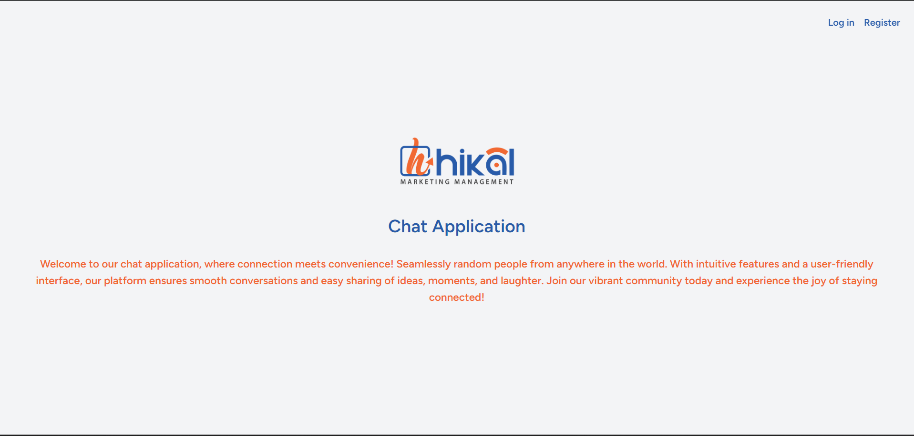

# Hikal Agency Task

## Chat Application

# Getting started

## Installation

Clone the repository

    git clone https://github.com/ramo772/orcas-task

Switch to the repo folder

    cd HikalAgencyTask
    
Install all the dependencies 

    composer install
    
    npm install

Copy the example env file and make the required configuration changes in the .env file

    cp .env.example .env

Add your pusher configurations and database credentials in the .env file

Generate a new application key

    php artisan key:generate

    npm run dev

Run the database migrations (**Set the database connection in .env before migrating**)

    php artisan migrate

Start the local development server

    php artisan serve

Link with your storage directory

    php artisan storage:link
    
start the Laravel WebSocket server by issuing the artisan command:

php artisan websockets:serve

You can now access the server at http://127.0.0.1:8000

# Views

### Dashboard

You will see register and login buttons in order to create a new account or login with exisitng account

After login you will go to the dashboard

